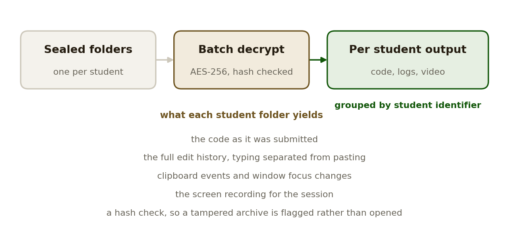

<div align="center">

# MINT Grader

Yuhyeon Lee · 2026

[](https://github.com/blueion0612/Mint_IDE_Teacher/actions/workflows/build.yml)
[](LICENSE)
[](#requirements)
[](#limitations)
[](https://github.com/blueion0612/Mint_IDE_Teacher/releases)

[**Releases**](https://github.com/blueion0612/Mint_IDE_Teacher/releases) · [**Student IDE**](https://github.com/blueion0612/Mint_IDE_Student) · [**Related**](#related)

<picture>
  <source media="(prefers-color-scheme: dark)" srcset="docs/figures/hero_grading-dark.png">
  
</picture>

</div>

*The grading pass. Decryption and the hash check, in gold, run once over the whole
batch; the per-student output, in green, is what the invigilator reads.*

**MINT Grader** is the invigilator's half of the pair. It takes a directory of sealed
exam folders produced by
[MINT Exam IDE](https://github.com/blueion0612/Mint_IDE_Student), verifies each one,
decrypts the batch in a single pass, and lays the results out per student so that the
code can be read next to the record of how it was written.

## Features

- **Point it at a folder.** Student identifiers are read from the manifests rather
  than typed in.
- **Hash verification before anything is opened**, so an archive that was altered
  after submission is reported instead of silently decrypted.
- **One pass over the batch.** AES-256, all submissions at once, not one at a time.
- **Everything the session recorded**, extracted per student: the code, the edit and
  activity logs, and the screen recording.

## Quick start

Download the installer from the
[releases page](https://github.com/blueion0612/Mint_IDE_Teacher/releases) and run it.
A desktop shortcut is created.

## Usage

1. Collect every `MINT_Exam_*` folder into one directory.
2. Open MINT Grader and select that directory.
3. Check the list of students it detected, then choose an output folder.
4. Run **Decrypt All Submissions**.

Results are written per student identifier, each with the submitted code, the
activity logs and the screen recording.

An archive that fails its hash check is reported rather than decrypted. That means
the file changed after the student handed it in, which is a question for the
invigilator and not something this tool decides.

## Repository layout

```
src/                  the front end, TypeScript
src-tauri/            the Rust side: decryption, hash checks, extraction
docs/figures/         README figure, the script that draws it, figstyle.py
```

## Requirements

To run the installer, nothing. To build from source, Node.js 18 or newer and Rust
1.70 or newer.

```bash
npm install
npx tauri build
```

## Limitations

- **Windows only.** Releases are built for Windows and nothing else is tested.
- **It reads what the student's session recorded, and no more.** A stream the
  student's machine never captured, because a permission was refused, is absent here
  rather than empty.
- **A hash check proves the archive is unchanged, not that the work is the
  student's.** Reading the edit history is what the tool is for.

## Related

- [MINT Exam IDE](https://github.com/blueion0612/Mint_IDE_Student): the student's
  half. It records the session and seals the submission this tool opens.

## License

MIT. See [LICENSE](LICENSE).
